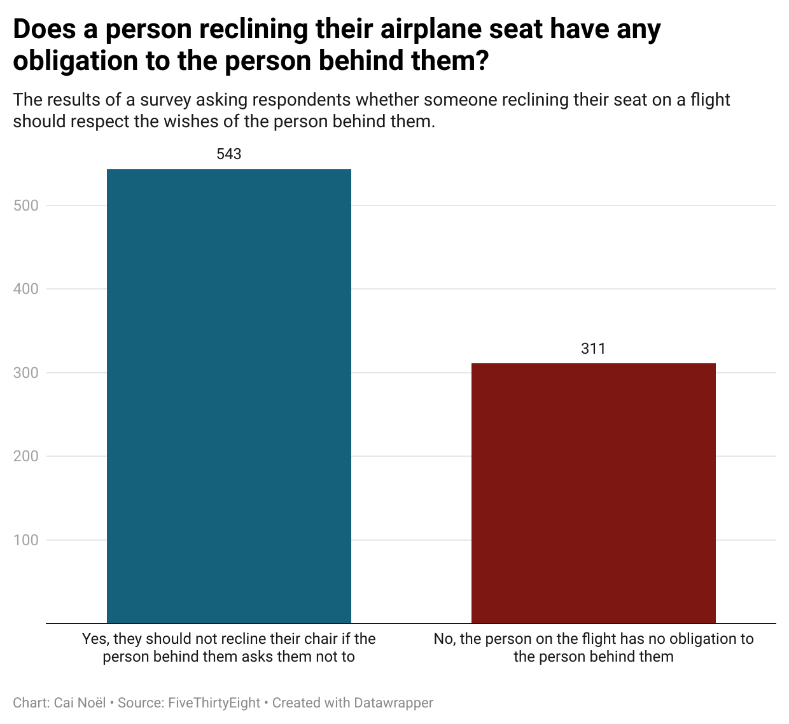

# J124 Repo

**Hello!** Welcome to my repository for Journalism 124!
-
<h3>Week 4 Assignment</h3>
I'm always looking to save money, and often fly in the cheapest seats available. Normally, these have pretty terrible comfort and legroom already, so when someone in front of me reclines their seat, it can be a bit irritating. Because of this, I always refrain from reclining my seat, unless there's nobody behind me. Sometimes, when I ask someone in front of me to extend the same courtesy, they...do not. I was curious whether my opinion on this was common or not, so I went with this question. 
 
My chart shows that a majority of people agree, and believe you have an obligation regarding the comfort of the person behind you – if they ask you not to recline your seat, those wishes should be respected. However, while this is a majority, there's still a sizeable chunk of the population that felt they are under no such obligation.

